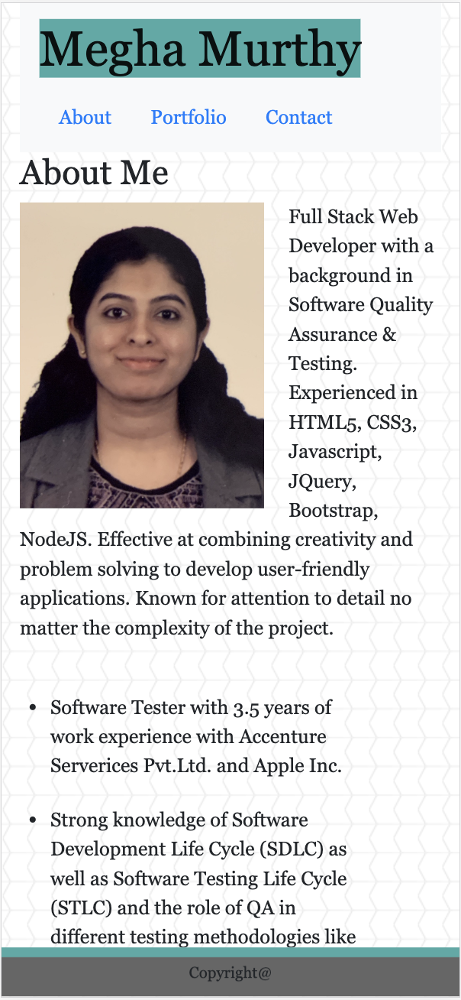
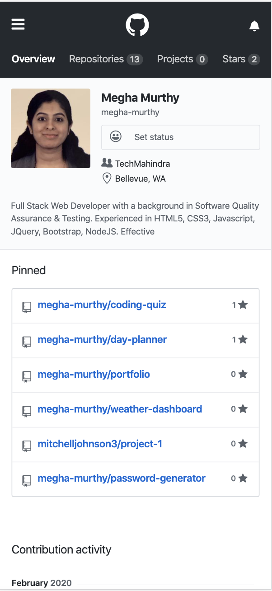
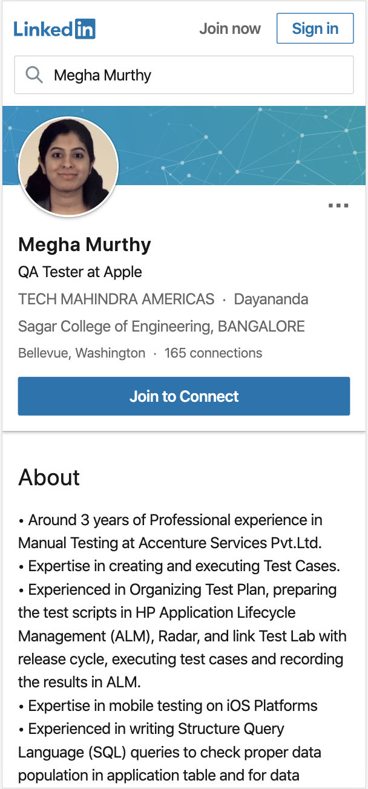
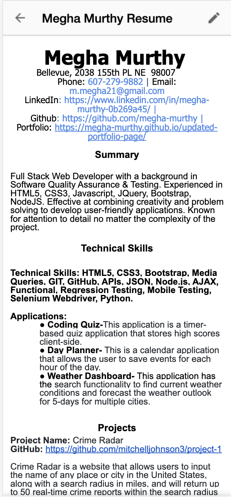

<<<<<<< HEAD
<<<<<<< HEAD

# Updated-portfolio-page

# Description
This is a mobile-first design for updated portfolio page featuring Project 1.

# Details:

Updated site has the following content:

 Name

 Links to GitHub profile & LinkedIn page as well as email address and contact phone number

 A link to the PDF of resume

 A list of projects. Each project has the following:

 1. Project title

 2. Link to the deployed version

 3. Link to the GitHub repository

  - Update GitHub profile with pinned repositories featuring project 1 and five exemplary assignments.
  
  -  Updated resume
  
  - Updated LinkedIn profile

 

Screenshots:

=======
# updated-portfolio-page
updated portfolio page
>>>>>>> 888f8f0f5daa8a932c701892844da109548e86fd
